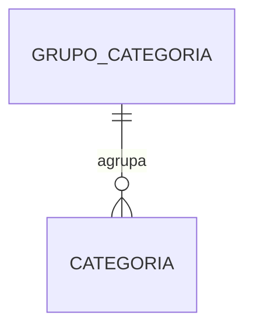
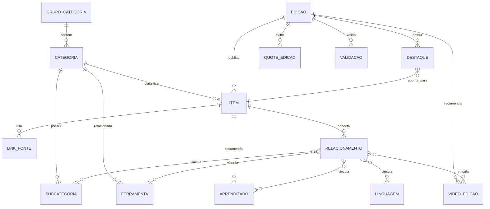
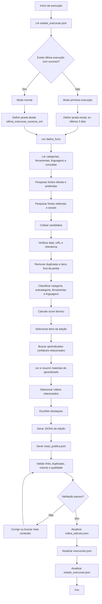
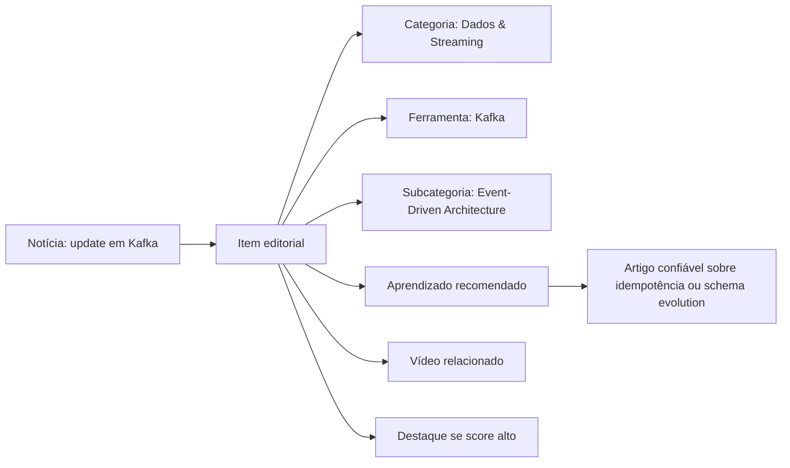
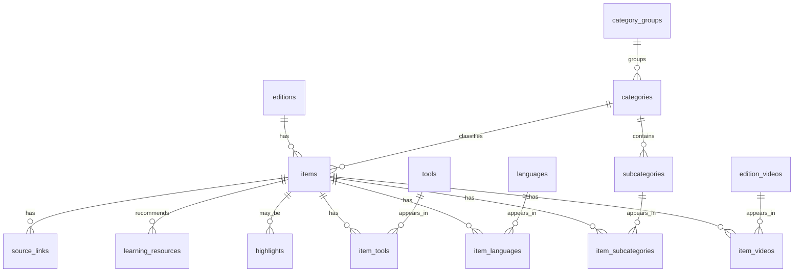

# CSR News — Modelo de Dados, Curadoria e Geração de Edições

> Documento de referência para entender como o CSR News organiza dados, gera edições, relaciona notícias com aprendizado e prepara a futura migração para banco de dados.

---

## 1. Visão geral

O **CSR News** é um radar técnico diário para engenharia, arquitetura de software e tecnologia aplicada.

A ideia central não é apenas listar notícias. A edição diária deve responder:

1. **O que aconteceu?**  
2. **Por que isso merece atenção técnica?**  
3. **Qual é o impacto para arquitetura, engenharia, segurança, operação ou produto?**  
4. **Onde aprender mais com uma fonte confiável?**

A IA atua como **curadora e editora técnica**, não como fonte absoluta de conhecimento. Ela pesquisa, cruza fontes, resume, relaciona assuntos e recomenda materiais confiáveis. O aprendizado profundo deve vir de **documentação oficial, blog de engenharia, autor reconhecido, artigo técnico ou vídeo confiável**.

---

## 2. Princípio editorial da nova abordagem

### Antes

O modelo antigo era mais próximo de um feed:

```text
notícia → resumo → por que importa
```

### Agora

O modelo novo é:

```text
notícia → contexto técnico → impacto → recurso confiável para aprender
```

A IA pode escrever:

- resumo da notícia;
- explicação curta do impacto;
- relação da notícia com arquitetura/engenharia;
- motivo para ler um tutorial/artigo/vídeo;
- resumo do material confiável, quando o conteúdo foi lido.

A IA **não deve inventar um tutorial inteiro** como se fosse documentação. O bloco de aprendizado deve apontar para uma fonte confiável.

---

## 3. Organização geral dos arquivos

A estrutura foi pensada como se os JSONs fossem tabelas de um banco de dados.

```text
data/
  dados_fixos/
    manifesto.json
    grupos_categorias.json
    categorias.json
    subcategorias.json
    grupos_ferramentas.json
    ferramentas.json
    linguagens.json
    consultas_pesquisa.json
    fontes_preferidas.json
    regras_editoriais.json
    tipos_conteudo.json
    autores_referencia.json
    canais_video.json

  edicoes/
    estado_execucao.json
    execucoes.json
    indice_edicoes.json

    ed_0001/
      edicao.json
      itens.json
      aprendizados.json
      relacionamentos.json
      links_fontes.json
      destaques.json
      videos_edicao.json
      quotes_edicao.json
      validacao.json
      visao_publica.json

    ed_0002/
      ...
```

### Separação principal

| Pasta | Papel | Equivalente futuro no banco |
|---|---|---|
| `data/dados_fixos/` | Dados estáveis usados pela skill e pelo frontend | Tabelas de catálogo/taxonomia |
| `data/edicoes/` | Dados gerados a cada execução diária | Tabelas transacionais/editoriais |
| `visao_publica.json` | JSON agregado pronto para o frontend | View materializada/API response |

---

## 4. Dados fixos

Os dados fixos são a base do sistema. Eles dizem para a skill **o que existe**, **o que procurar**, **onde procurar**, **como classificar** e **quais regras seguir**.

Eles ficam em:

```text
data/dados_fixos/
```

---

## 5. `manifesto.json`

### Objetivo

Define a identidade editorial do produto.

### Uso

A skill usa este arquivo para manter consistência de tom e propósito.

### Conteúdo esperado

Campos típicos:

```json
{
  "produto": "CSR News",
  "proposito": "Radar diário de notícias, contexto e aprendizado técnico para engenharia e arquitetura.",
  "principios": [
    "Curadoria acima de volume",
    "Aprendizado baseado em fontes confiáveis",
    "IA como editora, não como autoridade final",
    "Notícia precisa gerar contexto técnico"
  ]
}
```

---

## 6. `grupos_categorias.json`

### Objetivo

Agrupa categorias em macroáreas mais fáceis de entender.

As categorias originais continuam existindo, mas os grupos ajudam a interface e a navegação.

### Exemplo de grupos

```text
Arquitetura
Engenharia
Plataforma
Segurança
IA Aplicada
Mercado Técnico
```

### Uso

Usado por:

- landing page;
- menu principal;
- filtros macro;
- organização visual;
- futuras trilhas de aprendizado.

### Relação



---

## 7. `categorias.json`

### Objetivo

Define as categorias editoriais monitoradas pelo CSR News.

### Categorias atuais

O projeto mantém as 16 categorias atuais:

```text
ai
aiops
sec
cloud
devops
obs
backend
data
integ
testing
frontend
fundamentals
design
distarch
enterprise
fintech
```

### Campos principais

| Campo | Descrição |
|---|---|
| `id` | Identificador interno da categoria |
| `grupo_id` | Grupo macro ao qual pertence |
| `nome` | Nome exibido na interface |
| `rotulo_curto` | Nome curto para cards e filtros |
| `icone` | Emoji/ícone textual |
| `descricao` | Descrição editorial da categoria |
| `cor` | Cor/acento visual |
| `ordem` | Ordem de exibição |
| `ativo` | Indica se a categoria está ativa |

### Exemplo

```json
{
  "id": "aiops",
  "grupo_id": "ia_aplicada",
  "nome": "AIOps & Agents",
  "rotulo_curto": "AIOps",
  "icone": "🧠",
  "descricao": "LLMOps, agentes, MCP, RAG, evals, observabilidade de LLMs e coding agents.",
  "cor": "#C13CFF",
  "ordem": 2,
  "ativo": true
}
```

### Uso

Usado por:

- sidebar;
- cards de notícias;
- filtros por categoria;
- página de categoria;
- skill, para classificar itens;
- consultas de pesquisa.

---

## 8. `subcategorias.json`

### Objetivo

Define temas específicos dentro das categorias.

Subcategorias não precisam aparecer todas na interface principal. Elas funcionam como **tags estruturadas** e ajudam a skill a entender melhor o assunto.

### Exemplos

```text
RAG
MCP
OAuth2
OIDC
Supply Chain
OpenTelemetry
Backpressure
Idempotência
Event-Driven Architecture
DDD
C4 Model
PostgreSQL
Kafka
Kubernetes
```

### Campos principais

| Campo | Descrição |
|---|---|
| `id` | Identificador da subcategoria |
| `categoria_id` | Categoria principal |
| `nome` | Nome exibido |
| `descricao` | O que significa |
| `aliases` | Termos alternativos para busca |
| `ativo` | Se está ativa |

### Exemplo

```json
{
  "id": "backpressure",
  "categoria_id": "fundamentals",
  "nome": "Backpressure",
  "descricao": "Controle de pressão em sistemas que precisam desacelerar produtores conforme a capacidade dos consumidores.",
  "aliases": ["pressure control", "flow control", "controle de pressão"],
  "ativo": true
}
```

### Uso

Usado por:

- geração de queries;
- classificação fina de notícias;
- recomendação de aprendizado;
- filtros avançados;
- relacionamento entre notícia e conceito.

---

## 9. `grupos_ferramentas.json`

### Objetivo

Agrupa ferramentas por área técnica.

### Exemplos

```text
Cloud & Infra
Dados & Bancos
DevOps & CI/CD
Diagramas
Frontend
IA & Coding
Observabilidade
Segurança
```

### Uso

Usado por:

- sidebar;
- tela de ferramentas;
- agrupamento visual;
- seleção de rotação diária da skill.

---

## 10. `ferramentas.json`

### Objetivo

Catálogo de ferramentas monitoradas.

Cada ferramenta pode gerar:

- notícia;
- release;
- changelog;
- tutorial relacionado;
- alerta de segurança;
- vídeo;
- conteúdo evergreen.

### Exemplos de ferramentas

```text
Kubernetes
Docker
Terraform
Argo CD
GitHub Actions
GitHub
Nginx
Istio
PostgreSQL
MongoDB
Redis
Kafka
RabbitMQ
AWS SNS
AWS SQS
Databricks
Datadog
Dynatrace
Keycloak
Spring Boot
Spring Framework
Maven
Gradle
VS Code
IntelliJ IDEA
Cursor
Claude Code
Structurizr
PlantUML
Mermaid
SonarQube
Checkmarx
Angular
React
```

### Campos principais

| Campo | Descrição |
|---|---|
| `id` | Identificador da ferramenta |
| `nome` | Nome exibido |
| `grupo_id` | Grupo visual |
| `categoria_ids` | Categorias relacionadas |
| `icone` | Nome do ícone/asset |
| `descricao` | Descrição curta |
| `url_oficial` | Site oficial |
| `url_changelog` | Changelog/release notes |
| `url_docs` | Documentação |
| `aliases` | Termos usados em busca |
| `ativo` | Se está ativa |
| `destaque` | Se aparece como destaque visual |

### Exemplo

```json
{
  "id": "postgres",
  "nome": "PostgreSQL",
  "grupo_id": "dados_bancos",
  "categoria_ids": ["data"],
  "icone": "postgres",
  "descricao": "Banco relacional maduro para sistemas transacionais, extensões e workloads analíticos moderados.",
  "url_oficial": "https://www.postgresql.org/",
  "url_changelog": "https://www.postgresql.org/docs/release/",
  "url_docs": "https://www.postgresql.org/docs/",
  "aliases": ["postgresql", "postgres"],
  "ativo": true,
  "destaque": true
}
```

### Uso

Usado por:

- página de ferramenta;
- filtro no painel lateral;
- geração de queries específicas;
- relacionamento com itens da edição;
- rotação diária de ferramentas;
- futura personalização por usuário.

---

## 11. `linguagens.json`

### Objetivo

Catálogo das linguagens monitoradas diretamente.

### Linguagens atuais

```text
Java & JVM
JavaScript / TypeScript
Python
```

### Campos principais

| Campo | Descrição |
|---|---|
| `id` | Identificador |
| `nome` | Nome exibido |
| `icone` | Nome do ícone/asset |
| `descricao` | Descrição curta |
| `url_oficial` | Página oficial |
| `aliases` | Termos para busca |
| `ativo` | Se está ativa |

### Uso

Usado por:

- página de linguagem;
- filtros;
- cards relacionados;
- busca de releases, PEPs, JDKs, TC39, Node, Deno, Bun etc.

---

## 12. `consultas_pesquisa.json`

### Objetivo

Centraliza as queries de pesquisa da skill.

A skill não deve ter todas as buscas hardcoded no prompt. Ela deve ler este arquivo e montar buscas com base em:

- categorias;
- subcategorias;
- ferramentas;
- linguagens;
- fontes preferidas;
- janela de execução.

### Campos típicos

```json
{
  "categoria_id": "sec",
  "consultas": [
    "critical CVE OR zero-day software supply chain",
    "security advisory CVSS 9 Kubernetes Docker Keycloak",
    "OIDC SAML OAuth2 identity provider vulnerability"
  ]
}
```

### Regras de uso

A skill deve:

1. substituir placeholders de data;
2. incluir limite temporal;
3. preferir fontes oficiais;
4. complementar com fontes editoriais;
5. usar busca ampla apenas quando necessário.

### Exemplo de placeholder

```text
{data_inicio}
{data_fim}
{ano_atual}
```

Exemplo gerado:

```text
Kubernetes release security CVE after:2026-04-28 published after 28 de abril de 2026
```

---

## 13. `fontes_preferidas.json`

### Objetivo

Catálogo das fontes confiáveis.

### Tipos de fonte

| Tipo | Descrição |
|---|---|
| `oficial` | Documentação, changelog ou blog do vendor/projeto |
| `editorial` | InfoQ, The New Stack, ACM Queue etc. |
| `autor_referencia` | Fowler, Kleppmann, Hohpe, Julia Evans etc. |
| `engenharia` | Blogs de engenharia de empresas |
| `social` | HN, Lobste.rs, GitHub Trending |
| `governo_regulador` | CISA, NVD, Banco Central etc. |

### Tiers

| Tier | Uso |
|---|---|
| 1 | Fonte primária/oficial; maior prioridade |
| 2 | Fonte técnica confiável/editorial/autores |
| 3 | Comunidade, agregadores e sinais sociais |

### Uso

A skill usa para:

- priorizar fontes;
- validar confiabilidade;
- evitar sites fracos;
- classificar links;
- buscar aprendizado confiável.

---

## 14. `regras_editoriais.json`

### Objetivo

Guarda regras de curadoria, qualidade, anti-duplicidade, volume e seleção.

### Exemplos de regras

```text
- Preferir fonte oficial para releases.
- Itens de segurança com CVE devem trazer severidade.
- Não repetir URLs das últimas edições.
- Evitar clickbait.
- Notícia precisa ter impacto técnico claro.
- Aprendizado deve apontar para fonte confiável.
- IA não deve inventar tutorial completo.
```

### Uso

Usado pela skill em todas as fases:

1. coleta;
2. classificação;
3. escrita;
4. validação;
5. geração da view pública.

---

## 15. `tipos_conteudo.json`

### Objetivo

Define os tipos editoriais aceitos.

### Tipos sugeridos

| Tipo | Uso |
|---|---|
| `noticia` | Notícia simples com impacto técnico |
| `noticia_explicada` | Notícia com contexto técnico mais forte |
| `atualizacao_ferramenta` | Update de ferramenta |
| `release` | Release oficial |
| `alerta_seguranca` | CVE, vulnerabilidade ou incidente |
| `guia_decisao` | Comparação técnica entre opções |
| `tutorial_curado` | Tutorial externo recomendado |
| `fundamento_relacionado` | Conceito clássico ligado à edição |
| `estudo_caso` | Caso real de empresa, incidente ou arquitetura |
| `video_recomendado` | Vídeo técnico curado |

### Uso

Usado em:

- cards;
- filtros;
- ranking;
- agrupamento da edição;
- estratégia de busca.

---

## 16. `autores_referencia.json`

### Objetivo

Lista autores confiáveis para aprendizado e fundamentos.

### Exemplos

```text
Martin Fowler
Martin Kleppmann
Gregor Hohpe
Sam Newman
Kent Beck
Eric Evans
Julia Evans
Brendan Gregg
Dan Luu
Charity Majors
Kelsey Hightower
Werner Vogels
```

### Uso

Usado para:

- buscar artigos evergreen;
- recomendar aprendizado;
- selecionar quotes;
- enriquecer fundamentos.

---

## 17. `canais_video.json`

### Objetivo

Catálogo de canais confiáveis para vídeos técnicos.

### Campos principais

| Campo | Descrição |
|---|---|
| `id` | Identificador do canal |
| `nome` | Nome do canal |
| `url` | URL do canal |
| `plataforma` | YouTube, Vimeo etc. |
| `idioma` | Idioma principal |
| `categoria_ids` | Temas cobertos |
| `confiabilidade` | Alta, média, baixa |

### Uso

A skill pode usar para buscar vídeos relacionados a uma edição.

---

# 18. Dados por edição

Cada execução bem-sucedida gera uma nova edição.

A edição tem:

- número;
- data de publicação;
- janela de busca;
- itens editoriais;
- links de fonte;
- aprendizados confiáveis;
- vídeos;
- destaques;
- quotes;
- validação;
- visão pública.

---

## 19. `estado_execucao.json`

### Objetivo

Controla a última execução válida.

Esse arquivo é essencial para saber de onde a próxima busca deve começar.

### Exemplo

```json
{
  "schema_version": "2.0",
  "timezone": "America/Sao_Paulo",
  "ultima_execucao_sucesso_id": "run_20260429_180000",
  "ultima_execucao_sucesso_em": "2026-04-29T18:00:00-03:00",
  "ultima_edicao_publicada_id": "ed_0003",
  "ultima_edicao_numero": 3,
  "proxima_edicao_numero": 4,
  "status": "ok"
}
```

### Regra importante

A skill só deve atualizar este arquivo depois que a edição for validada e publicada.

Se a execução falhar no meio, a próxima execução continua buscando desde a última execução bem-sucedida.

---

## 20. `execucoes.json`

### Objetivo

Histórico de execuções.

### Exemplo

```json
[
  {
    "id": "run_20260429_180000",
    "edicao_id": "ed_0003",
    "modo": "normal",
    "status": "sucesso",
    "iniciada_em": "2026-04-29T17:40:00-03:00",
    "finalizada_em": "2026-04-29T18:00:00-03:00",
    "janela_inicio": "2026-04-28T18:00:00-03:00",
    "janela_fim": "2026-04-29T18:00:00-03:00",
    "contagens": {
      "itens": 28,
      "aprendizados": 12,
      "videos": 6,
      "destaques": 3
    }
  }
]
```

### Uso

Usado para:

- auditoria;
- diagnóstico;
- rastreabilidade;
- futura tela administrativa.

---

## 21. `indice_edicoes.json`

### Objetivo

Índice público e técnico de todas as edições.

### Exemplo

```json
[
  {
    "id": "ed_0003",
    "numero": 3,
    "data": "2026-04-29",
    "slug": "2026-04-29",
    "status": "publicada",
    "titulo": "IA, segurança e dados no radar técnico",
    "resumo": "Edição com foco em agentes, segurança e decisões sobre dados.",
    "publicada_em": "2026-04-29T18:00:00-03:00",
    "janela_inicio": "2026-04-28T18:00:00-03:00",
    "janela_fim": "2026-04-29T18:00:00-03:00",
    "item_hero_id": "item_ed0003_001",
    "categorias_principais": ["aiops", "sec", "data"],
    "caminhos": {
      "edicao": "data/edicoes/ed_0003/edicao.json",
      "visao_publica": "data/edicoes/ed_0003/visao_publica.json"
    }
  }
]
```

### Uso

Usado por:

- home;
- calendário;
- histórico de edições;
- carrossel de edições recentes;
- skill para montar blocklist.

---

# 22. Arquivos dentro de cada edição

Cada edição fica em uma pasta própria:

```text
data/edicoes/ed_0003/
```

---

## 23. `edicao.json`

### Objetivo

Guarda metadados e narrativa editorial da edição.

### Campos principais

| Campo | Descrição |
|---|---|
| `id` | ID da edição |
| `numero` | Número sequencial |
| `data` | Data da edição |
| `dia_semana` | Dia da semana em português |
| `titulo` | Título editorial |
| `subtitulo` | Subtítulo |
| `descricao` | Descrição geral |
| `nota_editorial` | Interpretação editorial da edição |
| `tempo_leitura` | Tempo estimado total |
| `janela_inicio` | Início da busca |
| `janela_fim` | Fim da busca |
| `hero` | Destaque principal |

### Uso

Usado para:

- cabeçalho da edição;
- hero;
- resumo da home;
- SEO futuro;
- arquivo de edições.

---

## 24. `itens.json`

### Objetivo

Tabela principal da edição.

Cada item representa uma unidade editorial:

- notícia;
- release;
- alerta de segurança;
- atualização de ferramenta;
- fundamento relacionado;
- guia de decisão;
- estudo de caso;
- vídeo recomendado.

### Exemplo

```json
[
  {
    "id": "item_ed0003_001",
    "edicao_id": "ed_0003",
    "tipo_conteudo": "noticia_explicada",
    "status": "publicado",
    "titulo": "OpenAI anuncia novo recurso para agentes e reacende debate sobre governança",
    "titulo_curto": "Agentes e governança",
    "subtitulo": "A notícia é sobre agentes, mas o impacto é sobre segurança, custo e controle operacional.",
    "categoria_id": "aiops",
    "subcategoria_principal_id": "agents",
    "resumo": "A notícia mostra avanço em agentes de IA integrados ao fluxo de engenharia.",
    "o_que_aconteceu": "Foi anunciado um novo recurso para orquestração de agentes em tarefas de desenvolvimento.",
    "por_que_importa": "Agentes passam a executar tarefas com impacto real no ciclo de software, o que exige governança e observabilidade.",
    "impacto_tecnico": "Times precisam revisar permissões, logs, rastreabilidade, limites de execução e critérios de rollback.",
    "acao_recomendada": "avaliar",
    "maturidade": "avaliar",
    "nivel_impacto": "alto",
    "confianca": "media",
    "impactos_arquitetura": ["seguranca", "governanca", "operacao", "custo"],
    "evergreen": false,
    "politica_frescura": "dentro_da_janela",
    "tempo_leitura": 6,
    "nivel": "intermediario",
    "score": 8,
    "destaque": true,
    "criado_em": "2026-04-29T17:30:00-03:00"
  }
]
```

### Campos explicados

| Campo | Descrição |
|---|---|
| `tipo_conteudo` | Classifica o formato editorial |
| `categoria_id` | Categoria principal |
| `subcategoria_principal_id` | Tema específico dominante |
| `o_que_aconteceu` | Resumo factual |
| `por_que_importa` | Motivo de atenção técnica |
| `impacto_tecnico` | Consequência prática para engenharia/arquitetura |
| `acao_recomendada` | O que o leitor deveria fazer |
| `maturidade` | Adopt, trial, assess, caution etc. |
| `nivel_impacto` | Baixo, médio, alto, crítico |
| `confianca` | Confiança da curadoria |
| `score` | Pontuação para ordenação |

---

## 25. `aprendizados.json`

### Objetivo

Guarda recursos confiáveis de aprendizado relacionados aos itens.

Este arquivo **não deve ser um tutorial inventado pela IA**.

Ele deve apontar para:

- documentação oficial;
- artigo técnico confiável;
- blog de engenharia;
- autor reconhecido;
- vídeo confiável;
- paper ou material clássico.

### Exemplo

```json
[
  {
    "id": "apr_ed0003_001",
    "edicao_id": "ed_0003",
    "item_id": "item_ed0003_001",
    "tipo": "artigo",
    "titulo": "Designing robust and predictable agents",
    "conceito_principal": "governanca_de_agents",
    "nivel": "intermediario",
    "tempo_estimado": 12,
    "fonte": {
      "nome": "Blog oficial do vendor",
      "tipo": "oficial",
      "url": "https://exemplo.com/artigo"
    },
    "descricao": "Material recomendado para entender padrões de segurança, rastreabilidade e controle em agentes de IA.",
    "por_que_ler": "Ajuda a separar automação útil de automação sem governança.",
    "relacao_com_item": "A notícia fala de agentes executando tarefas reais; o material explica como controlar permissões, contexto e rastreabilidade.",
    "resumo_curado": "O artigo defende que agentes devem ter limites claros, logs auditáveis, permissões mínimas e mecanismos de avaliação antes de executar ações sensíveis.",
    "confianca": "alta",
    "validado": true
  }
]
```

### O que a IA pode fazer aqui

A IA pode:

- encontrar o material;
- verificar se a fonte é confiável;
- ler o conteúdo;
- gerar um resumo curto;
- explicar por que o material se relaciona com a notícia.

A IA não deve:

- criar um tutorial inteiro do zero;
- apresentar opinião longa sem fonte;
- inventar recomendação como se fosse fato.

---

## 26. `relacionamentos.json`

### Objetivo

Centraliza relações entre itens, ferramentas, linguagens, tags, subcategorias, vídeos e aprendizados.

### Exemplo

```json
[
  {
    "item_id": "item_ed0003_001",
    "ferramenta_ids": ["claudecode", "github", "cursor"],
    "linguagem_ids": [],
    "tag_ids": ["agents", "governanca", "llmops"],
    "subcategoria_ids": ["agents", "llm_observability", "mcp"],
    "aprendizado_ids": ["apr_ed0003_001"],
    "video_ids": ["vid_ed0003_001"],
    "itens_relacionados_ids": ["item_ed0003_006"]
  }
]
```

### Por que esse arquivo existe?

Para simular tabelas N:N de banco de dados.

No futuro, ele vira tabelas como:

```text
item_ferramentas
item_linguagens
item_tags
item_subcategorias
item_aprendizados
item_videos
item_relacionados
```

### Uso

Usado para:

- página de ferramenta;
- página de linguagem;
- filtros;
- busca;
- recomendações;
- montagem da `visao_publica.json`.

---

## 27. `links_fontes.json`

### Objetivo

Guarda os links reais usados em cada item.

Um item pode ter mais de uma fonte:

- fonte principal;
- fonte alternativa;
- fonte oficial;
- fonte editorial;
- fonte social;
- fonte de aprendizado.

### Exemplo

```json
[
  {
    "id": "link_ed0003_001",
    "item_id": "item_ed0003_001",
    "fonte_id": "src_openai",
    "titulo": "OpenAI announces new agent capabilities",
    "url": "https://exemplo.com/noticia",
    "tipo_fonte": "oficial",
    "publicado_em": "2026-04-29T10:00:00-03:00",
    "verificado_em": "2026-04-29T17:50:00-03:00",
    "principal": true,
    "imagem": "https://exemplo.com/og-image.png"
  }
]
```

### Regras

- URL principal não pode ser homepage genérica.
- Release precisa apontar para release específico.
- CVE precisa ter fonte específica.
- Links de aprendizado devem ser confiáveis.
- Links devem ser verificados antes da publicação.

---

## 28. `destaques.json`

### Objetivo

Define os principais itens da edição.

Não duplica o item inteiro. Apenas referencia `item_id`.

### Exemplo

```json
[
  {
    "id": "dest_ed0003_main",
    "edicao_id": "ed_0003",
    "item_id": "item_ed0003_001",
    "slot": "principal",
    "ordem": 1,
    "motivo": "Maior impacto arquitetural da edição"
  },
  {
    "id": "dest_ed0003_risco",
    "edicao_id": "ed_0003",
    "item_id": "item_ed0003_002",
    "slot": "risco",
    "ordem": 2,
    "motivo": "Requer atenção de segurança"
  },
  {
    "id": "dest_ed0003_aprendizado",
    "edicao_id": "ed_0003",
    "item_id": "item_ed0003_003",
    "slot": "aprendizado",
    "ordem": 3,
    "motivo": "Melhor material para aprender na edição"
  }
]
```

### Slots sugeridos

| Slot | Uso |
|---|---|
| `principal` | Maior tema do dia |
| `risco` | Segurança, CVE, incidente ou breaking change |
| `aprendizado` | Melhor conteúdo de aprendizado |
| `ferramenta` | Release ou update de ferramenta relevante |

---

## 29. `videos_edicao.json`

### Objetivo

Define vídeos associados à edição.

### Exemplo

```json
[
  {
    "id": "vid_ed0003_001",
    "edicao_id": "ed_0003",
    "url": "https://www.youtube.com/watch?v=abc123",
    "provider": "youtube",
    "provider_video_id": "abc123",
    "titulo": "Como pensar governança para agentes de IA",
    "canal": "Canal Técnico",
    "avatar_canal": "https://exemplo.com/avatar.png",
    "publicado_em": "2026-04-27",
    "duracao": "22 min",
    "categoria_ids": ["aiops"],
    "tag_ids": ["agents", "governanca"],
    "itens_relacionados_ids": ["item_ed0003_001"],
    "motivo": "Complementa a discussão sobre agentes e controle operacional.",
    "nivel": "intermediario"
  }
]
```

### Uso

Usado por:

- seção de vídeos da edição;
- card do item;
- página de categoria;
- futuras trilhas.

---

## 30. `quotes_edicao.json`

### Objetivo

Define frases usadas na edição.

Pode referenciar quotes de um catálogo fixo ou trazer quotes específicas da edição.

### Exemplo

```json
[
  {
    "id": "quote_ed0003_001",
    "edicao_id": "ed_0003",
    "texto": "Simplicity is prerequisite for reliability.",
    "autor": "Edsger Dijkstra",
    "contexto": "Simplicidade operacional em sistemas distribuídos",
    "relacionado_a": "cat:fundamentals",
    "slot": "barra_topo",
    "ordem": 1
  }
]
```

### Uso

Usado por:

- barra superior de frases;
- hero;
- rodapé editorial.

---

## 31. `validacao.json`

### Objetivo

Guarda o resultado dos checks de qualidade da edição.

### Exemplo

```json
{
  "edicao_id": "ed_0003",
  "validado_em": "2026-04-29T17:58:00-03:00",
  "status": "aprovado",
  "checks": {
    "minimo_itens": true,
    "minimo_destaques": true,
    "links_verificados": true,
    "sem_urls_duplicadas": true,
    "aprendizados_com_fonte_confiavel": true,
    "diversidade_fontes": true
  },
  "avisos": [
    {
      "tipo": "baixa_cobertura_categoria",
      "mensagem": "Poucos itens em Frontend nesta edição."
    }
  ]
}
```

### Uso

Usado pela skill antes de publicar a edição.

---

## 32. `visao_publica.json`

### Objetivo

Arquivo agregado e pronto para o frontend.

O frontend não precisa carregar 10 arquivos e resolver tudo sozinho. A skill monta uma visão pública com:

- dados da edição;
- itens já enriquecidos;
- categorias resolvidas;
- ferramentas resolvidas;
- aprendizados ligados;
- fontes;
- vídeos;
- destaques;
- quotes.

### Uso

Usado diretamente pelo `nova-home.html`.

### Motivo

Mantém o frontend simples.

A estrutura interna continua parecida com banco de dados, mas a tela consome como se fosse uma API.

---

# 33. Relacionamento entre os dados



---

# 34. Fluxo da skill



---

# 35. Como a skill busca dados

## 35.1 Entrada

A skill começa lendo:

```text
data/dados_fixos/categorias.json
data/dados_fixos/subcategorias.json
data/dados_fixos/ferramentas.json
data/dados_fixos/linguagens.json
data/dados_fixos/consultas_pesquisa.json
data/dados_fixos/fontes_preferidas.json
data/dados_fixos/regras_editoriais.json
data/edicoes/estado_execucao.json
```

## 35.2 Janela de busca

A janela é definida assim:

### Primeira execução

Busca últimos dias configurados nas regras editoriais.

Exemplo:

```text
janela_inicio = início do dia D-3
janela_fim = agora
```

### Execução normal

Busca desde a última execução bem-sucedida.

```text
janela_inicio = ultima_execucao_sucesso_em
janela_fim = agora
```

## 35.3 Fontes

A skill deve buscar primeiro em:

1. fontes oficiais;
2. changelogs e release notes;
3. fontes editoriais confiáveis;
4. autores de referência;
5. blogs de engenharia;
6. sinais sociais, como HN, Lobste.rs e GitHub Trending;
7. busca ampla, apenas quando necessário.

## 35.4 A skill busca só nos sites fixos?

Não obrigatoriamente.

Regra recomendada:

- **começar pelas fontes fixas**;
- **priorizar fontes fixas**;
- **usar busca ampla quando as fontes fixas não cobrem bem a janela**;
- **não aceitar fonte fraca apenas porque apareceu na busca**.

A fonte ampla precisa passar por validação:

- tem autor ou organização confiável?
- tem data?
- tem conteúdo real?
- é relevante para arquitetura/engenharia?
- não é clickbait?
- não é cópia rasa de release?

---

# 36. Como a skill classifica um item

Cada candidato encontrado precisa ser transformado em item editorial.

Processo:

1. identificar assunto principal;
2. escolher `categoria_id`;
3. escolher `subcategoria_principal_id`;
4. vincular ferramentas;
5. vincular linguagens;
6. adicionar tags;
7. identificar tipo de conteúdo;
8. definir impacto;
9. definir ação recomendada;
10. calcular score.

---

# 37. Tipos de ação recomendada

| Valor | Quando usar |
|---|---|
| `ler` | Conteúdo relevante, mas sem ação imediata |
| `monitorar` | Tema emergente ou ainda instável |
| `avaliar` | Merece análise técnica ou PoC |
| `testar` | Bom candidato para experimento controlado |
| `adotar` | Maduro e recomendado em cenários claros |
| `corrigir` | Exige patch, atualização ou mitigação |
| `evitar` | Alto risco ou abordagem problemática |

---

# 38. Critérios de score

O score ajuda a ordenar itens e escolher destaques.

Sugestão:

| Sinal | Pontos |
|---|---:|
| Fonte oficial | +3 |
| Release oficial | +3 |
| CVE crítica ou incidente relevante | +3 |
| Impacto arquitetural claro | +2 |
| Múltiplas fontes independentes | +2 |
| Fonte Tier 1 ou autor referência | +2 |
| Tema relacionado às ferramentas monitoradas | +1 |
| Tema recorrente em HN/Lobste.rs/GitHub Trending | +1 |
| Material com bom aprendizado associado | +1 |

Exemplo:

```text
score = fonte + impacto + urgência + relevância + aprendizado
```

---

# 39. Ordenação dos dados na interface

## Home

Prioridade:

1. destaque principal;
2. risco/segurança;
3. melhor aprendizado;
4. maior score;
5. maior impacto;
6. mais recente;
7. diversidade de categorias.

## Página da edição

Ordem sugerida:

1. hero;
2. destaques;
3. itens de alta prioridade;
4. aprendizado da edição;
5. vídeos;
6. demais itens por categoria;
7. quotes/fontes.

## Página de categoria

Ordem sugerida:

1. itens da categoria na edição atual;
2. itens de edições recentes;
3. aprendizados relacionados;
4. ferramentas relacionadas;
5. vídeos relacionados.

## Página de ferramenta

Ordem sugerida:

1. releases e alertas;
2. notícias explicadas;
3. tutoriais curados;
4. vídeos;
5. fundamentos relacionados.

---

# 40. Regra profissional para aprendizado

O bloco de aprendizado deve ser tratado como **recurso recomendado**, não como conteúdo inventado.

## Estrutura ideal no card

```text
Aprenda mais
Título do artigo/tutorial/vídeo
Fonte · Tipo · Nível · Tempo estimado
Por que ler: explicação curta
```

## Estrutura ideal na página do item

```text
Conceito relacionado
Por que este conceito aparece nesta notícia
Resumo curado do material
Link para a fonte
Materiais complementares
```

## Regra de confiança

Todo aprendizado deve ter:

- fonte;
- URL;
- tipo de fonte;
- relação com o item;
- nível;
- resumo curado;
- confiança;
- indicação se foi validado.

---

# 41. Exemplo completo de relacionamento notícia + aprendizado



---

# 42. Como evitar erro e alucinação

A skill deve seguir estas regras:

1. **Nunca afirmar que um artigo diz algo sem ler ou validar o conteúdo.**
2. **Não transformar opinião gerada em recomendação absoluta.**
3. **Separar claramente resumo editorial de fonte primária.**
4. **Preferir documentação oficial quando o item for release.**
5. **Preferir autores reconhecidos quando o item for fundamento.**
6. **Não usar URL genérica como fonte principal.**
7. **Não usar tutorial aleatório quando existir fonte melhor.**
8. **Não repetir URL das últimas edições.**
9. **Não usar material fora da janela como notícia recente.**
10. **Evergreen é permitido, mas deve ser marcado como evergreen.**

---

# 43. Campos importantes para migração futura para banco

## Tabelas fixas futuras

```text
category_groups
categories
subcategories
tool_groups
tools
languages
tags
sources
video_channels
content_types
editorial_rules
reference_authors
```

## Tabelas editoriais futuras

```text
editions
runs
items
learning_resources
source_links
highlights
edition_videos
edition_quotes
validations
```

## Tabelas de relacionamento futuras

```text
item_tools
item_languages
item_tags
item_subcategories
item_learning_resources
item_videos
related_items
```

---

# 44. Diagrama de banco futuro



---

# 45. O que o frontend deve consumir

O frontend pode consumir apenas:

```text
data/dados_fixos/categorias.json
data/dados_fixos/ferramentas.json
data/dados_fixos/linguagens.json
data/edicoes/indice_edicoes.json
data/edicoes/{edicao_id}/visao_publica.json
```

Não é necessário o frontend resolver todos os relacionamentos manualmente.

A `visao_publica.json` deve vir pronta.

---

# 46. Por que manter `visao_publica.json`

Porque ela funciona como uma API estática.

A skill monta algo como:

```json
{
  "edicao": {},
  "destaques": [],
  "itens": [],
  "videos": [],
  "quotes": [],
  "fontes": []
}
```

Cada item já pode vir enriquecido com:

- categoria resolvida;
- ferramentas resolvidas;
- aprendizados resolvidos;
- links principais;
- vídeos relacionados.

Isso reduz complexidade no `nova-home.html`.

---

# 47. Exemplo de item pronto para a view pública

```json
{
  "id": "item_ed0003_001",
  "tipo_conteudo": "noticia_explicada",
  "titulo": "Agentes de IA avançam, mas exigem governança técnica",
  "categoria": {
    "id": "aiops",
    "nome": "AIOps & Agents",
    "icone": "🧠",
    "cor": "#C13CFF"
  },
  "resumo": "A notícia mostra avanço em agentes aplicados ao ciclo de engenharia.",
  "o_que_aconteceu": "Novo recurso permite orquestrar agentes em tarefas de desenvolvimento.",
  "por_que_importa": "Agentes passam a executar ações com impacto real em código, infraestrutura e operação.",
  "impacto_tecnico": "É necessário revisar permissões, logs, rollback, auditoria e limites de execução.",
  "acao_recomendada": "avaliar",
  "nivel_impacto": "alto",
  "fonte_principal": {
    "nome": "Fonte Oficial",
    "url": "https://exemplo.com/noticia"
  },
  "aprendizados": [
    {
      "titulo": "Como desenhar agentes seguros",
      "fonte_nome": "Blog oficial",
      "url": "https://exemplo.com/tutorial",
      "por_que_ler": "Ajuda a definir limites, permissões e rastreabilidade para agentes.",
      "resumo_curado": "O material defende permissões mínimas, logs auditáveis e avaliação antes de ações sensíveis."
    }
  ],
  "ferramentas": ["claudecode", "github"],
  "tags": ["agents", "governanca", "llmops"]
}
```

---

# 48. Regras finais para a skill

A skill deve:

1. ler `estado_execucao.json`;
2. definir janela de busca;
3. carregar dados fixos;
4. pesquisar por categoria, ferramenta e linguagem;
5. priorizar fonte oficial;
6. buscar material confiável de aprendizado;
7. validar URLs;
8. classificar candidatos;
9. criar itens;
10. criar aprendizados relacionados;
11. criar relacionamentos;
12. selecionar destaques;
13. gerar vídeos e quotes da edição;
14. validar tudo;
15. gerar `visao_publica.json`;
16. atualizar `indice_edicoes.json`;
17. atualizar `execucoes.json`;
18. atualizar `estado_execucao.json` por último.

---

# 49. Resumo mental do modelo

```text
Dados fixos dizem o que existe e como procurar.
Execução define a janela.
Edição organiza o dia.
Itens representam notícias e conteúdos editoriais.
Aprendizados apontam para fontes confiáveis.
Relacionamentos conectam tudo.
Visão pública entrega o resultado pronto para o site.
```

---

# 50. Regra de ouro

> O CSR News não deve apenas dizer o que saiu.  
> Ele deve mostrar o que merece atenção técnica, por que importa e onde aprender mais com confiança.

